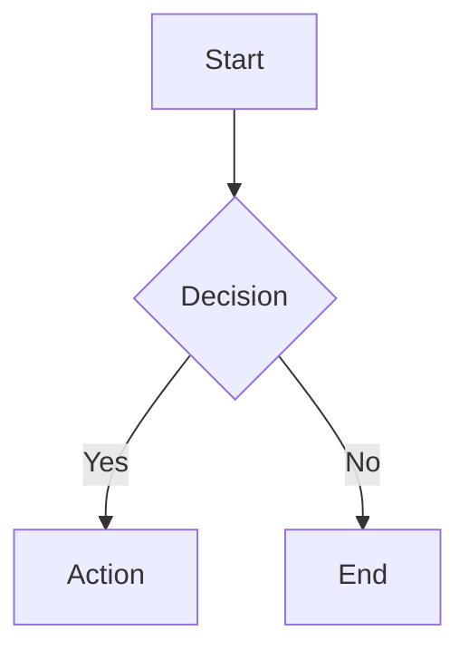

Publish markdown files as beautifully designed web pages on zo.space.

## When to Use

Activate this skill when the user:
- Asks to "publish" a markdown file, note, or document
- Wants to turn a note into a website or web page
- Says "make this a page" or "put this online"
- Asks to publish, share, or host a document
- Wants a Craft-docs-style published page
- References this skill by name

## How It Works

1. Read the user's markdown file
2. Run the converter script to generate styled React/TSX code
3. Use `update_space_route` to publish the page to zo.space
4. Return the live URL to the user

## Running the Skill

### Publish a File

```bash
bun run /home/workspace/Skills/publish-page/scripts/publish.ts <file> [options]
```

The script outputs a JSON payload with the route path, title, style, and generated page code.

Parse the `PUBLISH_OUTPUT:` line from stdout to extract the JSON, then call `update_space_route(path, "page", code, public)` to deploy it.

### Options

| Flag | Description |
|------|-------------|
| `--path <route>` | Custom URL path (default: derived from filename) |
| `--title <title>` | Override the page title |
| `--style <preset>` | Style preset (see below) |
| `--accent <hex>` | Custom accent/link color (e.g. `#2563eb`) |
| `--private` | Require authentication to view |
| `--list` | List published pages (use `list_space_routes` directly) |
| `--unpublish <path>` | Remove a page (use `delete_space_route` directly) |

### Style Presets

| Preset | Description |
|--------|-------------|
| `editorial` | **(default)** Playfair Display + Source Serif 4. Warm off-white background, magazine-quality serif typography. Inspired by literary journals and editorial design. |
| `minimal` | Inter. Pure white background, clean Swiss-style design. Maximum readability, zero decoration. |
| `warm` | Lora + Nunito Sans. Cream-toned background, serif headings with sans-serif body. Cozy and inviting. |
| `mono` | IBM Plex Mono + IBM Plex Sans. Dark background, monospace headings. Technical and distinctive. |
| `precision` | System UI + JetBrains Mono. Cool slate palette, borders-only depth, sharp radii. Inspired by developer tools and admin dashboards from [interface-design](https://github.com/Dammyjay93/interface-design). |
| `bold` | Space Grotesk. High contrast with red accents, dramatic heading sizes. For statement pieces and data-heavy content. |
| `sophisticated` | DM Serif Display + DM Sans. Cool tones with indigo accents, layered premium feel. For business and enterprise content. |

### Markdown Features Supported

- Headings (h1-h6) with distinct typographic hierarchy and anchor IDs
- Bold (`**` and `__`), italic (`*` and `_`), strikethrough (`~~`), highlighted text (`==`)
- Inline code with styled background
- Links with underline styling
- Images with captions (using title syntax: ``)
- GFM-style tables with column alignment (`:---`, `:---:`, `---:`)
- Code blocks with language labels and **syntax highlighting** (via Prism.js CDN)
- Mermaid diagrams (rendered as beautiful SVGs via beautiful-mermaid CDN)
- Blockquotes with left border accent
- Ordered and unordered lists
- Task list checkboxes (`- [x]` and `- [ ]`)
- Horizontal rules as elegant dividers
- YAML frontmatter: `title`, `subtitle`/`description`, `date`, `author`

### Page Features

Every published page includes:

- **Dark mode**: Auto-detects system preference (`prefers-color-scheme`) with a manual toggle button
- **Reading progress bar**: Thin colored bar at the top showing scroll position
- **Reading time estimate**: Word-count-based "X min read" shown in the hero section
- **Table of contents**: Auto-generated from headings (shown when 3+ headings exist), toggled via "Contents" button
- **Heading anchors**: All headings get `id` attributes for direct linking (`#section-name`)
- **Open Graph meta tags**: `og:title`, `og:description`, `og:type`, `twitter:card` for social sharing previews
- **Print stylesheet**: Clean print output — hides nav/progress, shows link URLs inline, wraps code blocks
- **Fade-in animations**: Staggered entrance animations on page load
- **Custom accent color**: Override the link/accent color with `--accent "#hex"` without changing presets

### Mermaid Diagrams

Pages support [beautiful-mermaid](https://github.com/lukilabs/beautiful-mermaid) for rendering diagrams. Just use standard mermaid code blocks in your markdown:

~~~markdown

~~~

Supported diagram types:
- **Flowcharts** — `graph TD`, `graph LR`, etc.
- **Sequence diagrams** — `sequenceDiagram`
- **Class diagrams** — `classDiagram`
- **ER diagrams** — `erDiagram`
- **State diagrams** — `stateDiagram-v2`

Diagrams are automatically themed to match the page's style preset — colors, fonts, and contrast all stay consistent with the surrounding content. The library is loaded from CDN only when mermaid blocks are present (zero overhead for pages without diagrams).

### Syntax Highlighting

Code blocks with a language identifier (e.g. ` ```javascript `) get syntax highlighting via [Prism.js](https://prismjs.com/) loaded from CDN. The autoloader plugin handles language detection automatically. Like mermaid, Prism is only loaded when code blocks with languages are present.

For dark themes (mono), the `prism-tomorrow` theme is used instead of the default light theme.

### Frontmatter Example

```yaml
---
title: My Essay Title
subtitle: A deeper exploration of the topic
author: zzzz
date: February 2026
---
```

## Workflow

1. User says: "publish Documents/Notes/my-essay.md"
2. Read the file
3. Run: `bun run /home/workspace/Skills/publish-page/scripts/publish.ts Documents/Notes/my-essay.md --style editorial`
4. Parse the PUBLISH_OUTPUT JSON from stdout
5. Call `update_space_route(path, "page", code, true)` with the extracted values
6. Tell the user: "Published at https://zzzz.zo.space{path}"

## Managing Pages

- **List pages**: Use `list_space_routes()` and filter for published pages
- **Update a page**: Re-run the publish command — it will overwrite the existing route
- **Remove a page**: Use `delete_space_route(path)`
- **Change style**: Re-publish with a different `--style` flag
- **Custom accent**: Re-publish with `--accent "#hex"` to override the link color

## Design Philosophy

Inspired by [interface-design](https://github.com/Dammyjay93/interface-design) principles:

- **Typography first**: Carefully paired fonts with proper hierarchy, generous line-height, and optimal reading width (640-720px)
- **Warm, not sterile**: Tinted backgrounds instead of pure white, tinted text instead of pure black
- **Breathing room**: Generous margins and spacing between elements
- **Subtle motion**: Gentle fade-in animations on page load
- **No clutter**: No sidebars, no navbars with 10 links, no popups — just the content
- **Responsive**: Fluid typography with clamp() ensures readability on all devices
- **Intent over decoration**: Every design choice should trace back to what the page should feel like
- **Consistency beats perfection**: A coherent system with consistent values beats scattered "correct" choices
- **Depth strategy**: Each preset picks one approach (borders-only, subtle shadows, or layered) and commits

## Style Preview

Visit [/styles](https://zzzz.zo.space/styles) to see all 7 style presets side-by-side. The preview page has tabs to switch between editorial, minimal, warm, mono, precision, bold, and sophisticated — showing the same sample content in each style so you can compare before publishing.

## Live Examples

- [/styles](https://zzzz.zo.space/styles) — Style comparison with all 7 presets
- [/the-complete-feature-test](https://zzzz.zo.space/the-complete-feature-test) — Every feature demonstrated (tables, code, mermaid, TOC, dark mode)
- [/system-architecture](https://zzzz.zo.space/system-architecture) — Mermaid diagrams in action
- [/the-art-of-slow-computing](https://zzzz.zo.space/the-art-of-slow-computing) — Editorial style example
