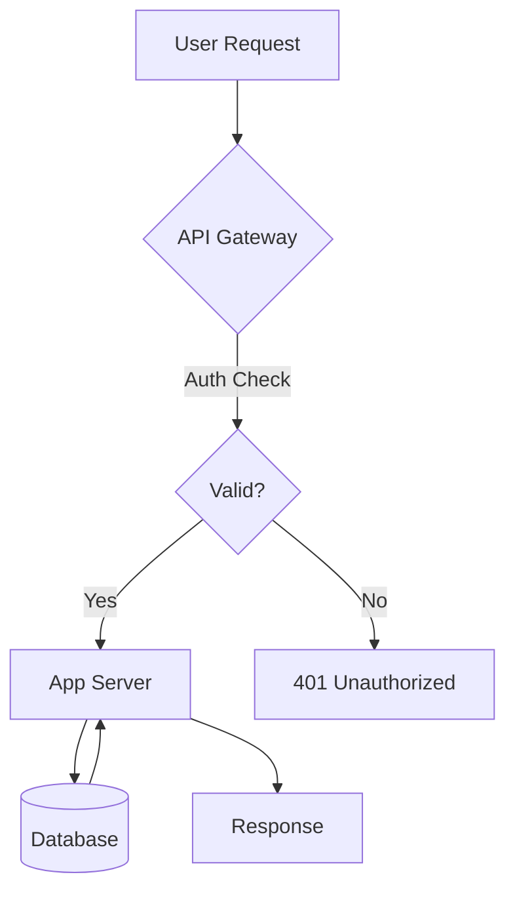

# Enhance for Publishing

You are enhancing a markdown file so it takes full advantage of the publish-page skill's features before deploying it as a beautiful web page on zo.space.

## Step 1: Read and Analyze

Read the file at: `$ARGUMENTS`

If no file path is given, ask the user which file to enhance.

Analyze the content for:
- **Length**: Count approximate words. If 2000+ words, flag as a long document.
- **Structure**: Does it have headings? Are they properly hierarchical (h2 → h3 → h4)?
- **Content type**: Technical? Personal? Business? Data-heavy? Tutorial? Creative?
- **Existing features**: Does it already have frontmatter? Tables? Code blocks? Diagrams?
- **Tone**: Formal? Casual? Academic? Conversational?

## Step 2: Handle Long Documents

If the document is over 2000 words:

1. Tell the user the word count and reading time estimate
2. Identify natural break points (major topic shifts, numbered sections, chapters)
3. Ask: "This is a long piece (~X words, ~Y min read). I can either:
   - **A)** Publish as one page with strong heading structure for TOC navigation
   - **B)** Split into a series of X linked pages
   Which do you prefer?"
4. If splitting: create separate enhanced files for each part, with prev/next links
5. If keeping as one: ensure excellent heading hierarchy and add horizontal rules between major sections

## Step 3: Pick the Style

If the user specified `--style`, use that. If they said `--style auto` or didn't specify, select based on content:

| Content Type | Style | Why |
|---|---|---|
| Technical docs, API references, changelogs, specs | `precision` | System UI, cool slate, borders-only — clinical and clear |
| Personal essays, blog posts, reflections, stories | `editorial` | Playfair Display + Source Serif — literary, warm |
| Business proposals, enterprise docs, strategy | `sophisticated` | DM Serif Display + DM Sans — indigo accents, premium |
| Data-heavy reports, comparisons, benchmarks | `bold` | Space Grotesk — high contrast, red accents, dramatic |
| Tutorials, how-tos, documentation, guides | `minimal` | Inter — Swiss-style, pure white, maximum readability |
| Personal notes, journal entries, letters | `warm` | Lora + Nunito Sans — cream tones, cozy |
| Developer logs, code-heavy content, READMEs | `mono` | IBM Plex Mono — dark background, techy |

Tell the user which style you picked and why. They can override.

## Step 4: Enhance the Markdown

Apply these enhancements to the content. **Preserve the author's voice and meaning.** You are polishing, not rewriting.

### 4a. Frontmatter

Add or improve YAML frontmatter at the top:

```yaml
---
title: [Clear, compelling title — refine if the original is vague]
subtitle: [One-line summary that hooks the reader]
author: zzzz
date: [Current month and year, e.g. "February 2026"]
---
```

- If the document already has a title as an h1, extract it to frontmatter and remove the duplicate h1
- Craft a subtitle that tells the reader what they'll get from this page

### 4b. Heading Hierarchy

Restructure headings for proper hierarchy:
- The page title comes from frontmatter (rendered as h1 in the hero section)
- Top-level sections should be `## h2` (these become the main TOC entries)
- Sub-sections should be `### h3` (indented in the TOC)
- Aim for 3-8 h2 headings for good TOC navigation
- If the document is flat (no headings), create logical section breaks

### 4c. Tables

Look for data that's currently in list form, inline comparisons, or prose that describes structured information. Convert to GFM tables:

Before:
```
The system supports three modes: fast mode which takes 2 seconds,
standard mode which takes 10 seconds, and thorough mode which takes 60 seconds.
```

After:
```
| Mode | Duration | Use Case |
|------|----------|----------|
| Fast | 2s | Quick checks |
| Standard | 10s | Normal workflow |
| Thorough | 60s | Final review |
```

Use column alignment where appropriate: `:---` left, `:---:` center, `---:` right.

### 4d. Mermaid Diagrams

Identify processes, workflows, architectures, decision trees, or sequences described in prose and convert to mermaid diagrams:

- **Processes/steps** → `graph TD` or `graph LR` flowcharts
- **Interactions between services/people** → `sequenceDiagram`
- **Decision logic** → flowcharts with diamond nodes `{Decision}`
- **System architecture** → `graph TD` with grouped nodes
- **State machines** → `stateDiagram-v2`

Before:
```
When a user submits a request, it goes to the API gateway,
which checks authentication. If valid, it forwards to the app
server which queries the database and returns a response.
```

After:
````

````

Don't force diagrams where they don't add value. 1-2 well-placed diagrams are better than 5 mediocre ones.

### 4e. Code Blocks

- Ensure all code blocks have a language identifier (```javascript, ```python, ```bash, etc.)
- If there are inline code snippets that would be better as blocks, expand them
- If code examples are missing but would clarify a concept, suggest adding them

### 4f. Highlights and Emphasis

- Use `==highlighted text==` for key takeaways, important definitions, or "don't miss this" moments
- Use blockquotes `>` for important quotes, callouts, or summary statements
- Use bold for the first mention of key terms or concepts
- Use task lists `- [x]` / `- [ ]` where there are action items, checklists, or requirements

### 4g. Visual Rhythm

- Add horizontal rules (`---`) between major sections for breathing room
- Ensure paragraphs aren't too long — break walls of text into digestible chunks
- Alternate between prose, lists, tables, and diagrams to create visual variety
- Every few paragraphs, the reader should encounter a non-prose element

## Step 5: Write the Enhanced File

Save the enhanced markdown to the vault's published folder:

```
/home/workspace/claudesidian-vault/07_Published/[slugified-title].md
```

Show the user a summary of changes:
- Word count (before → after)
- Features added (frontmatter, X tables, Y diagrams, Z highlights, etc.)
- Style selected
- Heading structure for TOC

Ask the user to review and approve before publishing.

## Step 6: Publish

Once approved, run the publish script:

```bash
bun run /home/workspace/Skills/publish-page/scripts/publish.ts /home/workspace/claudesidian-vault/07_Published/[file].md --style [selected-style]
```

Parse the `PUBLISH_OUTPUT:` JSON from stdout. Then call `update_space_route(path, "page", code, true)` to deploy.

Tell the user: "Published at https://zzzz.zo.space/[slug]"

## Rules

- **Never change the author's meaning or conclusions** — you're polishing, not editorializing
- **Preserve the author's voice** — if it's casual, keep it casual. If it's formal, keep it formal.
- **Don't add fluff** — every enhancement should add information density or clarity
- **Don't over-diagram** — only add mermaid where a visual genuinely helps understanding
- **Don't over-table** — only convert to tables when the data is genuinely structured/comparative
- **Always show the user what changed** before publishing
- **For long documents**: prioritize good heading structure over everything else — the TOC + progress bar will handle the UX
